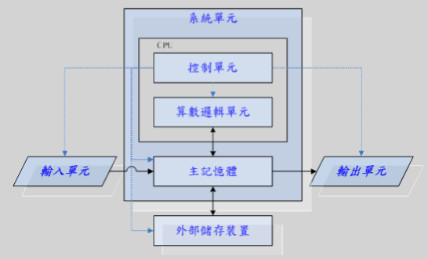

# 计算机概论

###计算机的组成部分

从外观说，可以分为以下三个部分：
* 输入单元：包括键盘、鼠标等
* 主机部分：包括CPU、主储存器等
* 输出单元：屏幕、打印机等

首先我们会通过键盘、鼠标等将一些数据输入到主机，然后由主机对输入数据进行处理，并将处理后的数据显示到屏幕或打印机上。整个主机的重点在于处理数据的CPU和储存输入数据的主存储器。CPU又分为主要负责协调各周边组件与各单元间工作的控制单元和主要负责程序运算与逻辑判断的算数运算单元。因此计算机可以说是由输入单元、控制单元、逻辑运算单元、主存储器、输出单元五大部分组成。

###CPU的种类

CPU可以分为精简指令集（RISC）和复杂指令集（CISC）。

使用精简指令集的CPU主要为ARM架构，大多数用于手机等移动电子产品。

使用复杂指令集的CPU主要为x86架构，有AMD和Intel两大主要生产商。

#####x86架构的命名由来

最早采用x86架构的那颗CPU的代号为8086

###接口设备
* 储存设备：硬盘、光盘..
* 显示设备：显示器、打印机..
* 网络设备：网卡

###计算机的分类

| 种类 | 英文名 | 级别 |
| -- | -- | -- |
| 超级计算机 | Super Computer | 国家级 |
| 大型计算机 | Mainframe Computer | 大企业级 |
| 迷你计算机 | Mini Computer | 科研级 |
| 工作站 | Workstation | 学术研究级 |
| 微电脑 | Micro Computer | 个人级 |

###容量单位

8bit = 1byte，
1024byte = 1k，
..

###速度单位

MHz，GHz

###主板架构

#####Intel

