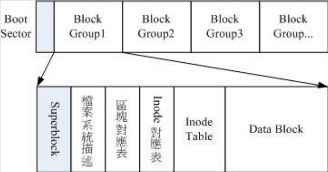
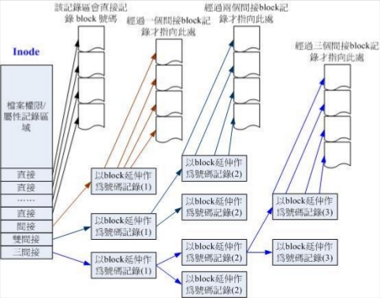

# Linux磁盘与文件系统管理

###认识ext2文件系统

索引式文件系统

* superblock：记录此filesystem的整体信息，包括inode/block的总量、使用量、剩余量，以及文件系统的格式与相关信息等
* inode：记录档案的属性，一个档案占用一个inode，同时记录此档案的数据所在的block号码
* block：实际记录档案的内容，若档案太大时，会占用多个block

###data block（资料区块）

data block是用来放置档案内容数据的地方

* 原则上，block的大小与数量载格式化完就不能再改变
* 每个block内最多只能放置一个档案的数据
* 若档案大于block，则一个档案会占用多个block
* 若档案小于block，则该block的剩余容量就不能再被使用

###inode table（inode表格）

inode的内容至少有

* 该档案的存取模式（read/write/excute）
* 该档案的拥有者与群组（owner、group）
* 该档案的容量
* 该档案建立或状态改变的时间（ctime）
* 最近读取时间（atime）
* 最近修改时间（mtime）
* 定义档案特性的flag，如SetUID
* 该档案真正内容的指向

inode的特点

* 每个inode的大小均固定为128bytes
* 每个档案都仅会占用一个inode
* 文件系统能够建立的档案数量与inode的数量有关
* 系统读取档案时需要先找到inode，并分析inode所记录的权限与用户是否符合，若符合才能开始实际读取block的内容`

###superblock（超级区块）

* block与inode的总量
* 未使用与已使用的inode/block数量
* block与inode的大小
* filesystem的挂载时间、最近一次写入数据的时间、最近一次检验磁盘的时间等文件系统的相关信息
* 一个valid bit数值，若此文件系统已被挂载，则valid bit为0,若未被挂载，则valid bit为1

###Filesystem Description（文件系统描述说明）

这个区段可以描述每个block group的开始与结束的block号码，以及说明每个区段分别介于哪一个block号码之间

###block bitmap（区块对照表）

记录了所有block的使用信息

###inode bitmap（inode对照表）

记录了所有inode的使用信息

