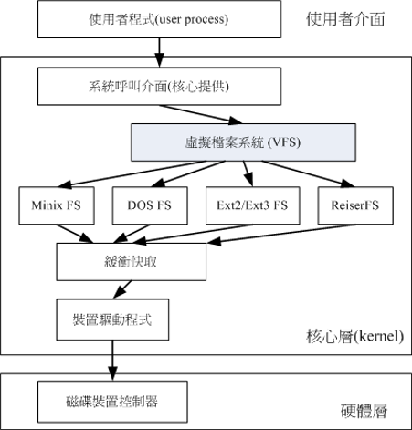

# Linux磁盘与文件系统管理

###认识ext2文件系统

索引式文件系统

* superblock：记录此filesystem的整体信息，包括inode/block的总量、使用量、剩余量，以及文件系统的格式与相关信息等
* inode：记录档案的属性，一个档案占用一个inode，同时记录此档案的数据所在的block号码
* block：实际记录档案的内容，若档案太大时，会占用多个block


###data block（资料区块）

data block是用来放置档案内容数据的地方

* 原则上，block的大小与数量载格式化完就不能再改变
* 每个block内最多只能放置一个档案的数据
* 若档案大于block，则一个档案会占用多个block
* 若档案小于block，则该block的剩余容量就不能再被使用

###inode table（inode表格）

inode的内容至少有

* 该档案的存取模式（read/write/excute）
* 该档案的拥有者与群组（owner、group）
* 该档案的容量
* 该档案建立或状态改变的时间（ctime）
* 最近读取时间（atime）
* 最近修改时间（mtime）
* 定义档案特性的flag，如SetUID
* 该档案真正内容的指向

inode的特点

* 每个inode的大小均固定为128bytes
* 每个档案都仅会占用一个inode
* 文件系统能够建立的档案数量与inode的数量有关
* 系统读取档案时需要先找到inode，并分析inode所记录的权限与用户是否符合，若符合才能开始实际读取block的内容`


###superblock（超级区块）

* block与inode的总量
* 未使用与已使用的inode/block数量
* block与inode的大小
* filesystem的挂载时间、最近一次写入数据的时间、最近一次检验磁盘的时间等文件系统的相关信息
* 一个valid bit数值，若此文件系统已被挂载，则valid bit为0,若未被挂载，则valid bit为1

###Filesystem Description（文件系统描述说明）

这个区段可以描述每个block group的开始与结束的block号码，以及说明每个区段分别介于哪一个block号码之间

###block bitmap（区块对照表）

记录了所有block的使用信息

###inode bitmap（inode对照表）

记录了所有inode的使用信息

```
dumpe2fs [-bh] 装置文件名

-b：列出保留为坏轨的部分
-h：仅列出superblock的数据，不会列出其他区段内容
```

###日志式文件系统

* 预备：当系统要写入一个档案时，会先在日志记录某个档案准备要写入的信息
* 实际写入：开始写入档案的权限与数据，开始更新metadata的数据
* 结束：完成数据与metadata的更新后，在日志记录区块当中完成该档案的记录


* metadata（中介资料）：super block、block bitmap、inode bitmap等
* 数据存放区域：inode block、data block


###Linux文件系统的运作

* 系统会将常用的档案数据放置到主存储器的缓冲区，以加速文件的读写
* 因此Linux的物理内存最后都会被用光
* 可以手动使用sync来强迫内存中设定为Dirty的档案回写当磁盘中
* 正常关机时，关机指令会主动呼叫sync来将内存的数据回写入磁盘内
* 不正常关机，由于数据尚未回写到磁盘内，因此重新启动后可能会花很多时间在进行磁盘检验，甚至可能导致文件系统的损毁

###Linux VFS（Virtual Filesystem Switch）



###文件系统的简单操作

####df：列出文件系统的整体磁盘使用量

```
df [-ahikHTm] [目录或文件名]

-a：列出所有文件系统，包括系统特有的/proc等文件系统
-k：以KBytes的容量显示各文件系统
-m：以MBytes的容量显示各文件系统
-h：以易阅读的GBytes、MBytes、KBytes等格式自行显示
-H：以M=1000K取代M=1024K的进位方式
-T：连同该partition的filesystem名称也列出
-i：不用硬盘容量，而以inode数量来表示

常用：hi
```

####du：评估文件系统的磁盘使用量

```
du [-ahskm] 档案或目录名称

-a：列出所有档案与目录容量，因为默认仅统计目录底下的档案量而已
-h：以易读的方式显示
-s：列出总量，而不列出每个目录占用容量
-S：不包括子目录下的总计
-k：以KBytes列出
-m：以MBytes列出
```

####实体链接与符号链接：ln

* Hard Link：实体链接，直接链接inode，不使用block，不能跨filesystem，不能link目录
* Symbolic Link：符号链接，创建新档案资源读取指向原档，占用inode与block

```
ln [-sf] 来源文件 目录文件

-s：默认hard link，加上后symbolic link
-f：如果目标文件存在时，就主动将目标文件直接移除后再建立
```
###磁盘的分割、格式化、检验与挂载

####磁盘分区：fdisk

```
fdisk [-l] 装置名称

-l：输出后面接的装置所有的partition内容。若仅有fdisk -l时，则系统将会把整个系统内能够搜索到的装置的partition均列出来

无法处理大于2TB的磁盘分区槽
```

####磁盘格式化：mkfs

```
mkfs [-t 文件系统格式] 装置文件名

-t：可以接文件系统格式，例如ext3、ext2、vfat等（系统支持才有效）
```

####磁盘检验：fsck、badblocks

fsck

```
fsck [-t 文件系统] [-ACay] 装置名称

-t：后接文件系统，通常会自动分辨
-A：依据/etc/fstab的内容，将需要的装置扫描一遍
-a：自动修复检查到的有问题的
-y：与-a类似，但是某些filesystem仅支持-y这个参数
-C：可以再检验的过程中，使用一个直方图来显示目前的进度
```

badblocks

```
badblocks -[svw] 装置名称

-s：在屏幕上列出进度
-v：在屏幕上列出进度
-w：使用写入的方式来测试
```


