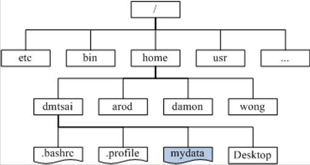
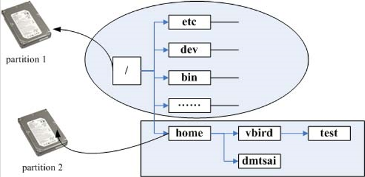

# Linux是什么


Linux是一种操作系统

###Linux的历史

#####Multics

早期的系统，太过庞大复杂

#####Unix

* Thompson
* 前身为Multics
* 由c语言编写核心
* 半开源状态（不可对学生提供源码）

两个重要的概念：

* 所有的程序或系统装置都是档案
* 不管建构编辑器还是附属档案，所写的程序只有一个目的，且要有效的完成目标

#####GNU计划

* 目的：建立一个自由、开放的Unix操作系统
* 成果：Emacs、GNU C(GCC)、GUN C library(glibc)、Bash shell

```
自由软件：
  取得软件与源码
  复制
  修改
  再发行
  回馈
  不可修改授权
  不可单纯贩卖
```

#####Minix

* 前身为Unix
* 移植到x86架构
* 半开源（只需一点点money）

#####Linux

* 前身为Minix
* 稳定的系统
* 免费或少许费用
* 安全性、漏洞额快速修补
* 多任务、多使用者
* 使用者与群组的规划
* 相对比较不耗资源的系统
* 适合需要小核心程序的嵌入式系统
* 整合度佳且多样的图形用户接口
* 

```
核心版本：
  主版本.次版本.释出版本-修改版本
  主、次版本为奇数：发展中版本
  主、次版本为偶数：稳定版本
```

###各硬件装置在Linux中的文件名

在Linux系统中，每一个装置都被当成一个档案来对待

|装置|文件名|
| -- | -- |
|IDE硬盘机|/dev/hd[a-d]|
|SCSI/SATA/USB硬盘机|/dev/sd[a-p]|
|USB快闪碟|/dev/sd[a-p]|
|软盘驱动器|/dev/f[0-1]|
|打印机|25针：/dev/lp[0-2]   USB：/dev/usb/lp[0-15]|
|鼠标|USB：/dev/usb/mouse[0-15]   PS2：/dev/psaux|
|当前CDROM/DVDROM|/dev/cdrom|
|当前鼠标|/dev/mouse|
|磁带机|IDE：/dev/ht0   SCSI：/dev/st0|

###磁盘分区

####磁盘组成

扇区+磁柱

第一个扇区

* 主要启动记录区（Master Boot Record,MBR）：可以安装开机管理程序的地方，有446bytes
* 分割表（partition table）：记录整颗硬盘分割的状态，有64bytes

####磁盘分区表

* 按磁柱号码对磁盘进行分割
* 主要分割槽+延伸分割槽<=4
* 命名：/dev/hda[1-4]

分割的好处

* 数据的安全性
* 系统的效能考虑

主要分割、延伸分割和逻辑分割的特性

* 主要分割与延伸分割最多可以有4个（硬盘限制）
* 延伸分割最多只能有一个（操作系统限制）
* 逻辑分割是由延伸分割持续切割出来的分割槽
* 能够被格式化后，作为数据存取的分割槽为主要分割与逻辑分割。延伸分割无法格式化
* 逻辑分割的数量依操作系统而不同，在Linux中，IDE硬盘最多有59个逻辑分割（5-63），SATA硬盘则有11个逻辑分割（5-15）

###开机流程

1. BIOS：开机主动执行的韧体，会认识第一个可开机的装置
2. MBR：第一个可开机装置的第一个扇区内的主要记录模块，内含开机管理程序
3. 开机管理程序（boot loader）：一个可读取核心档案来执行的软件
4. 核心档案：开始操作系统的功能

boot loader：是操作系统安装在MBR上的一套软件（先windows后linux的原因）

* 提供选单：用户可以选择不同的开机项目，这也是多重引导的重要功能
* 载入核心档案：直接指向可开机的程序区段来开始操作系统
* 转交其他loader：将开机管理功能转交给其他loader负责

###目录树结构

以根目录为主，然后向下呈现分支状的目录结构的一种档案架构




####文件系统与目录树的关系（挂载）

所谓挂载就是利用一个目录当成进入点，将磁盘分区槽的数据放置在该目录下



###命令行概述

command [-options] parameter1 parameter2 ...

####基础指令

```
date：显示日期
date +%Y%m%d

cal：显示日历
cal [month] [year]

bc：计算器
```

