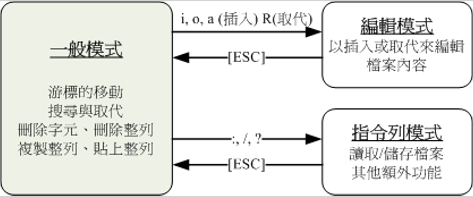

# vim程序编辑器

###vim的使用

|模式|作用|
|--|--|
|一般模式|以vi打开一个文档就直接进入一般模式。在一个模式中，可以使用上下左右来移动光标，可以使用删除字符或删除整行来处理档案内容，也可以使用复制、黏贴来处理文件数据|
|编辑模式|在一般模式中可以进行删除、复制、黏贴等等的操作，但是无法编辑文件内容。需要按下i,I,o,O,a,A,r,R等任何一个字母之后才会进入编辑，而如果要回到一般模式必须按下Esc|
|指令行模式|在一般模式中，按下:/?三个中的任何一个，就会进入指令行模式，可以进行搜寻、读取、储存、取代字符、离开、显示行号等等的动作|



####按键说明

第一部分：一般模式可用的按钮说明，光标移动、复制、黏贴、搜寻、取代等

|按键|动作|
|--|--|
|h或←|光标左移一个字符|
|j或↓|光标下移一个字符|
|k或↑|光标上移一个字符|
|l或→|光标右移一个字符|
|ctrl+f|下翻一页，相当于page down（常用）|
|ctrl+b|上翻一页，相当于page up（常用）|
|ctrl+d|下翻半页|
|ctrl+u|上翻半页|
|+|光标移动到非空格符的下一列|
|-|光标移动到非空格符的上一列|
|n<space>|n表示数字，按下数字后再按空格键，光标会向右移动n个字符|
|0或Home|移动到这一行的最前（常用）|
|$或End|移动到这一行的最后（常用）|
|H|光标移动到屏幕第一行的第一个字符|
|M|光标移动到屏幕中央一行的第一个字符|
|L|光标移动到屏幕最后一行的第一个字符|
|G|移动到档案的最后一行（常用）|
|nG|移动到档案的第n行|
|gg|移动到档案的第一行|
|n<Enter>|光标下移n行（常用）|
|/word|向光标后寻找字符串（常用）|
|?word|向光标前寻找字符串|
|n|重复前一个搜寻动作|
|N|反向进行前一个搜寻动作|
|:n1,n2s/word1/word2/g|n1与n2为数字，从第n1行与n2行之间寻找word1，并将该字符串取代为word2（常用）|
|:1,$s/word1/word2/g|从第一行到最后一行寻找word1，并将该字符串取代为word2（常用）|
|:1,$s/word1/word2/gc|从第一行到最后一行寻找word1，并将该字符串取代为word2，且在取代前向用户确认是否需要取代（常用）|
|x，X|在一行字中，x为先后删除一个字符，X为向前删除一个字符（常用）|
|nx|n为数字，连续向后删除n个字符|
|dd|删除游标所在的那一整列（常用）|
|ndd|n为数字，删除光标所在的向下n列（常用）|
|d1G|删除光标所在到第一行的所有数据|
|dG|删除光标所在到最后一行的所有数据|
|d$|删除光标所在到该行的最后一个字符|
|d0|删除光标所在到该行的最前一个字符|
|yy|复制游标所在行（常用）|
|nyy|n为数字，复制光标所在向下n行|
|y1G|复制光标所在到第一行的所有数据|
|yG|复制光标所在到最后一行的所有数据|
|y0|复制光标所在到行首的所有数据|
|y$|复制光标所在到行尾的所有数据|
|p，P|p为将已复制的数据在光标下一行贴上，P为上一行（常用）|
|j|将光标所在列与下一列的数据合并成同一列|
|c|复制删除多个数据|
|u|还原前一动作（常用）|
|ctrl+r|重复上一动作（常用）|
|.|重复前一动作|

第二部分：一般模式切换到编辑模式的可用按键说明

|按键|动作|
|--|--|
|i，I|进入插入模式，i为从目前光标所在处插入，I为在目前所在行的第一个非空格符出开始插入（常用）|
|a，A|进入插入模式，a为从目前光标所在的下一个字符处开始插入，A为从光标所在行的最后一个字符处开始插入（常用）|
|o，O|进入插入模式，o为从目前光标所在的下一行处开始插入，O为从光标所在的上一行插入新的一行（常用）|
|r，R|进入取代模式，r只会取代光标所在那个字符一次，R会一直取代光标所在的文字，直到按下ESC为止（常用）|
|Esc|退出编辑模式，回到一般模式（常用）|

第三部分：一般模式切换到指令行模式的可用按钮说明

|按键|动作|
|--|--|
|:w|将编辑的数据写入硬盘档案（常用）|
|!|强制|
|:q|离开（常用）|
|ZZ|若档案没有改动，则不储存离开，若档案已被改动，则储存后离开|
|:w [filename]|将编辑的数据储存成另一个档案（类似另存新档）|
|:r [filename]|在编辑的数据中，读入另一个档案的数据，即将filename这个档案的内容添加到游标所在行后面|
|:n1,n2 w [filename]|将n1到n2的内容储存成filename这个档案|
|:! command|暂时离开vi到命令行模式下执行command的显示结果|
|:set nu|显示行号|
|:set nonu|取消行号|

###vim的额外功能

####区块选择

|按键|动作|
|--|--|
|v|字符选择，会将光标经过的地方反白选择|
|V|行选择，会将光标经过的行反白选择|
|ctrl+v|区块选择，可以用长方形的方式选择|
|y|将反白的地方复制|
|d|将反白的地方删除|

####多档案编辑

|按键|动作|
|--|--|
|:n|编辑下一档案|
|:N|编辑上一档案|
|:files|列出目前这个vim开启的所有档案|

####多窗口功能

|按键|动作|
|--|--|
|:sp [filename]|开启一个新窗口，如果有filename，表示在新窗口开启新档案，否则表示两个窗口为同一档案内容|
|ctrl+w+j/↓|光标移动到下方窗口|
|ctrl+w+k/↑|光标移动到上方窗口|
|ctrl+w+q|关闭当前窗口|

####vim环境设定与记录

* ~/.vimrc：记录vi的设定
* ~/.viminfo：记录vi内的动作

vi的环境设定参数，可用:set all来查询

|按键|动作|
|--|--|
|:set nu/nonu|设定或取消行号|
|:set hlsearch/nohlsearch|设定是否将搜寻的字符串反白|
|:set autoindent/noautoindent|设定时候自动缩排|
|:set backup|设定自动备份，默认是nobackup|
|:set ruler|设定是否显示状态栏|
|:set showmode|设定是否显示左下角的状态栏|
|:set backspace=|当backspace设为2时，可以删除任意值，当backspace设为0/1时，仅可删除输入的字符|
|:set add|显示所有的环境参数设定值|
|:set|显示与系统默认值不同的设定参数|
|:syntax on/off|设定是否开启语法显色|
|:set bg=light/dark|设定背景颜色|

###其它注意事项

####DOS与Linux的断行字符

```
dos2unix [-kn] file [newfile]
unix2dos [-kn] file [newfile]

-k：保留该档案原本的mtime时间格式
-n：保留原本的旧档，将转换后的内容输出到新档案
```

####语系编码转换

```
iconv --list
iconv -f 原本编码 -t 新编码 filename [o newfile]

--list：列出iconv支持的语系数据
-f：from，后接原本的编码格式
-t：to，后接新编码格式
-o file：后接新档名，保留原档
```


